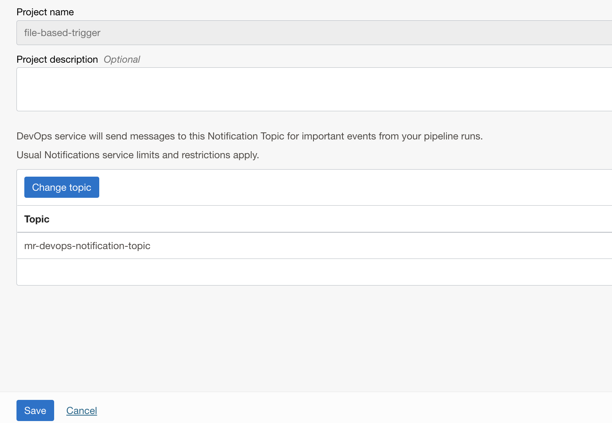
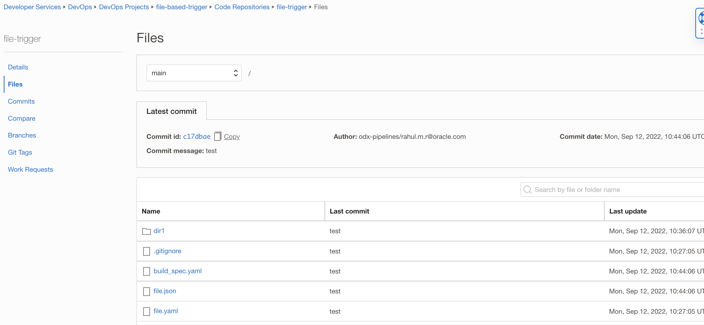
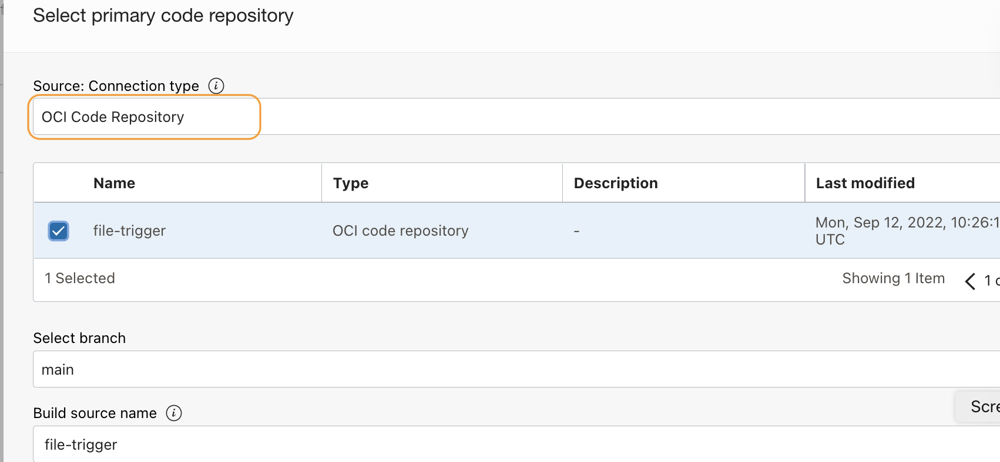
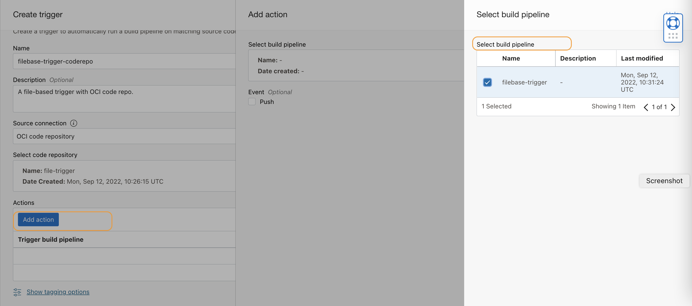
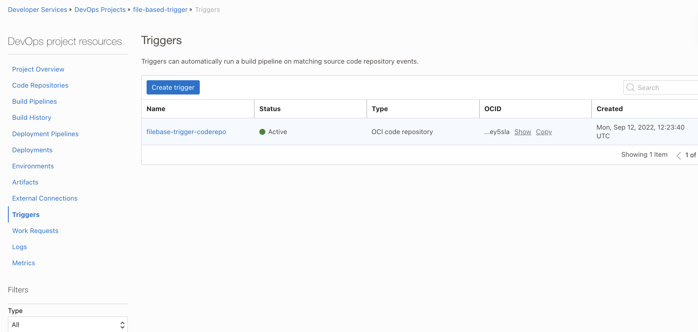
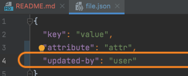
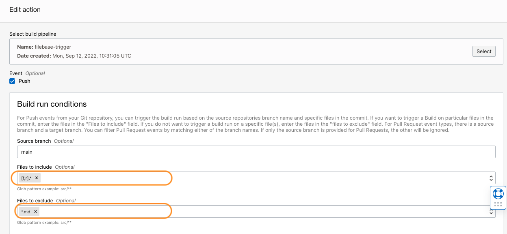

## Sample of **File-based Trigger Trigger** -  Trigger an OCI DevOps Build pipeline based on a file/s update.


In Oracle Cloud Infrastructure (OCI) DevOps, a build run can be automatically triggered when you commit your changes to a code repository.

You can control the trigger action by specifying the modified files in your repository to be included or excluded during the build run. The file-based trigger action is applicable only for the **Push** event.


### File-Based Trigger
For triggering a build run based on file changes, the following two options are provided:

**Files to include**: By default, changes to all files in the repository are included when a build run is triggered. The Files to include option allows you to specify a list of files and directories in the repository that you have changed and for which you want to trigger a build run. Files are specified using glob patterns. Trigger action is based on the changes affecting at least one of the included files.

**Files to exclude**: By default, changes to all files in the repository are included when a build run is triggered. The Files to exclude option allows you to specify a list of files and directories in the repository that you want to exclude from the build run. Files are specified using glob patterns. Changes affecting only the excluded files do not trigger a build. If files are specified for both include and exclude, then the exclude filter is applied to the output of the include filter.


#### Objectives

- Create an OCI DevOps project and code repo.
- Create an OCI DevOps build pipeline and trigger.
- Setup file include /exclude conditions and test.


### Procedure

#### OCI Notifications.

- Create an OCI notification topic - https://docs.oracle.com/en-us/iaas/Content/Notification/Tasks/managingtopicsandsubscriptions.htm#createTopic


#### OCI Identity setups.

- Create a dynamic group and add below rules. -

```java
ALL {resource.type = 'devopsbuildpipeline', resource.compartment.id = 'COMPARMENT OCID'}
ALL {resource.type = 'devopsrepository', resource.compartment.id = 'COMPARMENT OCID'}
```

- Create a policy with the below statements.

```java
Allow dynamic-group "NAME OF THE DynamicGroup" to manage repos in compartment "COMPARTMENT NAME"
Allow dynamic-group  "NAME OF THE DynamicGroup" to use ons-topics in compartment "COMPARTMENT NAME"
```
#### OCI DevOps setups.

- Create a DevOps project and associate it with the notification topic - https://docs.oracle.com/en-us/iaas/Content/devops/using/create_project.htm



- Ensure to enable logging for the projects.


- Create an OCI Code repo - https://docs.oracle.com/en-us/iaas/Content/devops/using/create_repo.htm


- Push the content to the code repo created. You may use [SSH based authorization](https://docs.oracle.com/en-us/iaas/Content/devops/using/clone_repo.htm#ssh_auth) or [HTTPS based authorization](https://docs.oracle.com/en-us/iaas/Content/devops/using/clone_repo.htm#https_auth).




- Create a new build pipeline - https://docs.oracle.com/en-us/iaas/Content/devops/using/create_buildpipeline.htm


- Within the build pipeline, add a Managed Build stage - https://docs.oracle.com/en-us/iaas/Content/devops/using/add_buildstage.htm


- Provide a name and description.


- Use select within Primary code repository and select the OCI Code repo created.



- Click Add and save the stage.


- Create a new DevOps trigger - https://docs.oracle.com/en-us/iaas/Content/devops/using/trigger_build.htm

- Provide a name and optional description.
-


- Select the OCI code repository as the Source connection.


- Select the code repository.


- Click on Add action and select the build pipeline created.



- Select the Event as Push. Fill the Build run conditions.


#### OCI DevOps trigger conditions.

- **Note** - Build run conditions

  - For the Push event, you can trigger the build run by specifying the source branch name and the files to be included or excluded in the build run.
  - (Optional) Enter the source repository branch on which the selected event triggers the build run.
  - If you select one of the Pull Request events, then you can also select the target code repository branch.
  - (Optional) Enter files to include for the trigger action. Files are specified using glob patterns.
  - For example, src/**/*.txt includes all text files in the "src" folder.
  - (Optional) Enter files to exclude the trigger action. Files are specified using glob patterns.
  - For example, **.html excludes all HTML files. For more examples and details.
  - Refer more for **Glob Patterns** - https://docs.oracle.com/en-us/iaas/Content/devops/using/glob-patterns.htm

- In this sample, we will be adding the below conditions.
  - Source branch: main / It's optional.
  - File to include : *.json and dire1/*.json / Update ona file with extension .json will trigger the build pipeline.
  - Files to exclude : *.yaml / For a sample, we will exclude yaml file updates


- Click create and save the trigger.




#### Test the conditions .

- Using cloud shell or local machine, add a new value to [file. json](file. json)



- This will trigger a build run and once completed, you may see the changes in the executions logs.


- To test the exclusion, update a value with the file. yaml and validate that there is NO execution.
- You can set up different trigger conditions and validate.


- Add new conditions, as an example here we are including all the files starting with `f` or `r` with any `extension` with the parent directory and excluding the `*.md` file. Once set up, update the files, push them to the code repo and validate the conditions.




Contributors
===========

- Author: Rahul M R.
- Collaborators: NA
- Last release: September 2022


